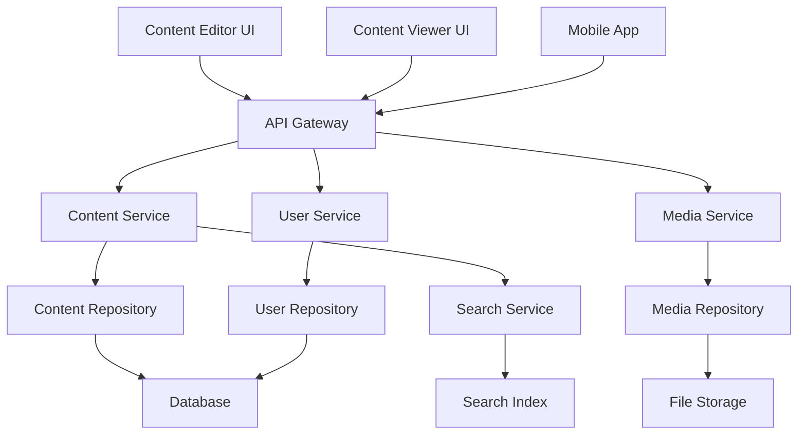

# Design Document

## Overview

The CMS (Content Management System) will be implemented as a headless, API-first system using a modern Scala/ZIO backend architecture with separate frontend applications for content editing and viewing. The system follows modular design principles with clear separation between content management, delivery, and presentation layers. This design enables omnichannel content delivery while providing intuitive authoring tools.

## Steering Document Alignment

### Technical Standards (tech.md)
The design follows modern API-first principles using ZIO HTTP for the backend services. The implementation leverages:
- ZIO ecosystem for functional, composable backend services
- RESTful API design with proper HTTP semantics
- JSON-based data exchange using ZIO JSON
- Modular architecture with domain-driven design

### Project Structure (structure.md) 
The implementation follows the established project organization:
- `apps/api/` - ZIO-based backend services
- `apps/ui/web/editor/` - Content creation and management interface
- `apps/ui/web/viewer/` - Content consumption and preview interface
- Domain-driven module structure within the API layer

## Code Reuse Analysis

### Existing Components to Leverage
Currently, the project is in early stages with minimal existing code. The design will establish foundational patterns:
- **ZIO HTTP Server**: Base HTTP server configuration and routing
- **Domain Models**: Core entity definitions for content, users, and permissions
- **Database Access Layer**: ZIO-based repository patterns

### Integration Points
- **API Gateway**: Centralized entry point for all CMS operations
- **Shared Type Definitions**: Common data models between frontend and backend
- **Authentication Service**: User session and permission management
- **File Storage**: Media asset storage and delivery system

## Architecture

The CMS follows a layered, hexagonal architecture pattern with clear separation of concerns:

### Modular Design Principles
- **Single File Responsibility**: Each file handles one specific domain concern (e.g., content models, user services)
- **Component Isolation**: API endpoints, business logic, and data access are separated into distinct modules
- **Service Layer Separation**: Clear boundaries between domain logic, application services, and infrastructure
- **Utility Modularity**: Shared utilities (validation, formatting, etc.) are extracted into focused modules



## Components and Interfaces

### API Gateway (apps/api/modules/gateway)
- **Purpose:** Route requests, handle authentication, and coordinate services
- **Interfaces:** HTTP endpoints for content, media, and user operations
- **Dependencies:** Content Service, Media Service, User Service
- **Reuses:** ZIO HTTP routing and middleware patterns

### Content Service (apps/api/modules/content)
- **Purpose:** Manage content lifecycle, versioning, and publication
- **Interfaces:** CRUD operations, publishing workflow, content queries
- **Dependencies:** Content Repository, Search Service, User Service
- **Reuses:** Domain entity patterns and validation utilities

### Media Service (apps/api/modules/media)
- **Purpose:** Handle file uploads, processing, and delivery optimization
- **Interfaces:** Upload endpoints, asset serving, metadata management
- **Dependencies:** Media Repository, File Storage Provider
- **Reuses:** Stream processing and validation patterns

### User Service (apps/api/modules/user)
- **Purpose:** Authentication, authorization, and user management
- **Interfaces:** Login/logout, role management, permission checks
- **Dependencies:** User Repository, Session Store
- **Reuses:** Security patterns and token management

### Content Editor (apps/ui/web/editor)
- **Purpose:** Provide intuitive content creation and management interface
- **Interfaces:** Rich text editor, media browser, content preview
- **Dependencies:** API Gateway, Real-time WebSocket connection
- **Reuses:** Common UI components and state management patterns

### Content Viewer (apps/ui/web/viewer)
- **Purpose:** Render published content with optimal performance
- **Interfaces:** Content display, navigation, search interface
- **Dependencies:** API Gateway (read-only endpoints)
- **Reuses:** Rendering utilities and responsive design patterns

## Data Models

### ContentType
```scala
case class ContentType(
  id: ContentTypeId,
  name: String,
  slug: String,
  fields: List[FieldDefinition],
  createdAt: Instant,
  updatedAt: Instant
)

case class FieldDefinition(
  name: String,
  fieldType: FieldType,
  required: Boolean,
  validationRules: List[ValidationRule]
)

enum FieldType:
  case Text, RichText, Number, DateTime, Media, Reference
```

### Content
```scala
case class Content(
  id: ContentId,
  contentTypeId: ContentTypeId,
  title: String,
  slug: String,
  fields: Map[String, FieldValue],
  status: ContentStatus,
  language: Language,
  authorId: UserId,
  createdAt: Instant,
  updatedAt: Instant,
  publishedAt: Option[Instant]
)

enum ContentStatus:
  case Draft, Review, Published, Archived
```

### Media
```scala
case class Media(
  id: MediaId,
  filename: String,
  mimeType: String,
  size: Long,
  url: String,
  thumbnails: Map[String, String],
  metadata: Map[String, String],
  uploadedBy: UserId,
  createdAt: Instant
)
```

### User
```scala
case class User(
  id: UserId,
  email: String,
  name: String,
  roles: Set[Role],
  isActive: Boolean,
  createdAt: Instant,
  lastLoginAt: Option[Instant]
)

enum Role:
  case Admin, Editor, Author, Viewer
```

## Error Handling

### Error Scenarios
1. **Content Validation Failure**
   - **Handling:** Return detailed validation errors with field-level feedback
   - **User Impact:** Form highlights specific fields with clear error messages

2. **Authentication/Authorization Failure**
   - **Handling:** Return appropriate HTTP status codes (401/403) with safe error messages
   - **User Impact:** Redirect to login or show permission denied message

3. **Media Upload Failure**
   - **Handling:** Validate file type/size before processing, clean up partial uploads
   - **User Impact:** Clear progress feedback and retry options

4. **Database Connection Issues**
   - **Handling:** Implement retry logic with exponential backoff, circuit breaker pattern
   - **User Impact:** Graceful degradation with appropriate user messaging

## Testing Strategy

### Unit Testing
- ZIO Test framework for pure business logic testing
- Mock repositories for isolated service testing
- Property-based testing for validation logic
- JSON schema validation for API contracts

### Integration Testing
- ZIO Test integration with real database using test containers
- API endpoint testing with ZIO HTTP TestKit
- File upload/processing pipeline testing
- Authentication flow testing

### End-to-End Testing
- Browser automation testing for editor workflows
- Content creation to publication full flow testing
- Multi-user collaboration scenarios
- Performance testing under content load